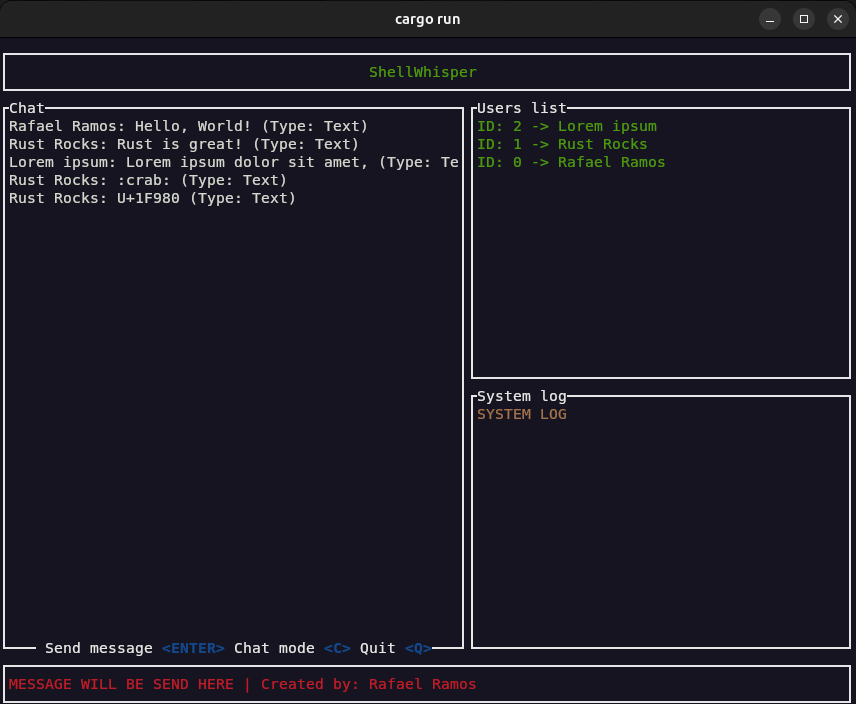

# 🦀 ShellWhisper



A modern terminal-based chat application built with Rust, featuring a clean and intuitive TUI (Terminal User Interface).

## Features

- Real-time messaging with multi-user support
- Live user list with connection status
- Modern terminal UI using Ratatui
- PostgreSQL for data persistence
- Async architecture with Tokio

## Tech Stack

- **Rust** - For blazingly fast performance and reliability
- **Ratatui** - Terminal UI framework
- **Tokio** - Async runtime for handling connections
- **PostgreSQL** - Database for message and user persistence
- **SQLx** - SQL toolkit for Rust

## Getting Started

### Prerequisites

- Rust (latest stable version)
- PostgreSQL
- cargo

### Installation

1. Clone the repository

```bash
git clone https://github.com/yourusername/shellwhisper.git
cd shellwhisper
```
